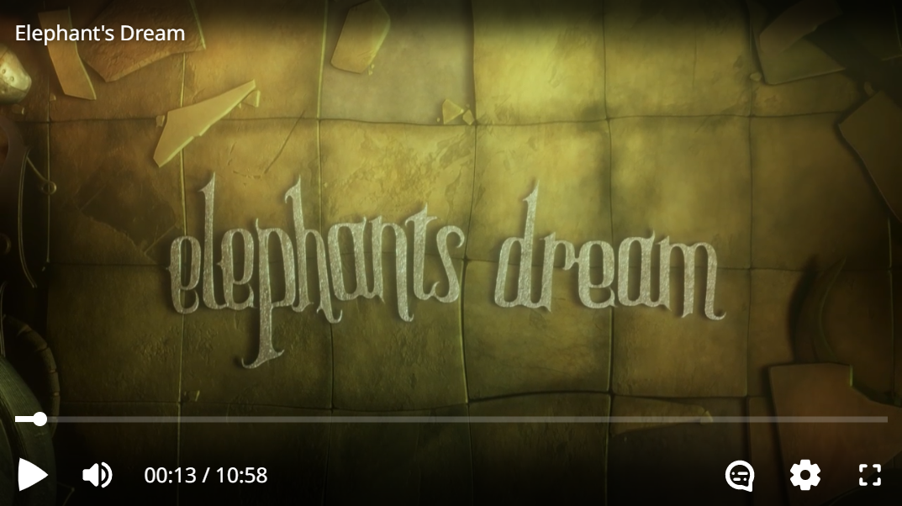
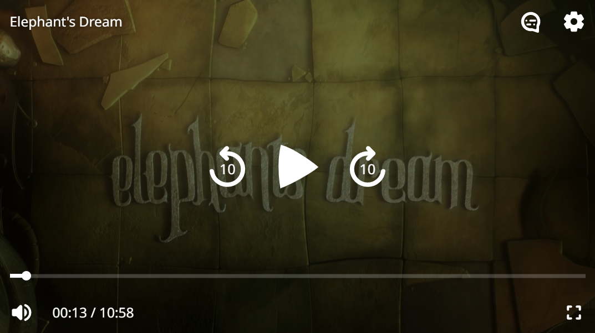

# THEOplayer Web UI

A component library for building a world-class video player experience powered by
the [THEOplayer Web SDK](https://www.theoplayer.com/product/theoplayer).

-   Use the default UI for a great out-of-the-box experience, or use the individual components to build your own custom UI.
-   Built using [Web Components](https://developer.mozilla.org/en-US/docs/Web/Web_Components), so works great with (or without) any app framework.
-   Easy to customize: use HTML to lay out your controls, and CSS to style them.

> **Warning**
> This project is experimental, and breaking changes can happen frequently. As such, it is not yet recommended for use in production. We are aiming for a first stable release soon, so feedback is welcome!

|  |  |
| :------------------------------------------------------------: | :----------------------------------------------------------: |
|                            Desktop                             |                            Mobile                            |

## Motivation

The current THEOplayer Web SDK comes with a built-in UI based on [video.js](https://github.com/videojs/video.js) through [the `Player` constructor](https://docs.theoplayer.com/api-reference/web/theoplayer.player.md). This new UI aims to solve some limitations from the old approach:

-   Designed with customization in mind. With the old UI, customizing anything beyond changing some text and icon colors was difficult, and could break in unpredictable ways when updating to a new THEOplayer version. With the new UI, all components can be customized in a variety of ways with well-documented attributes and CSS custom properties.
-   Built for the modern web. The old UI was built at a time when Internet Explorer was still a major browser, so it couldn't use newer web technologies. The new UI breaks with the past and takes full advantage of Web Components, so it works well in modern web apps.
-   Developed in the open. Although the old UI is based on the open-source video.js library, any custom components bundled with THEOplayer remained closed-source. With the new UI, the source code of all components is publicly available. Advanced users can learn about the inner workings of each component, modify them, and even contribute their changes back to THEOplayer Web UI.

> **Note**
> THEOplayer Web UI currently exists separately from the old THEOplayer UI. In the future, we hope to deprecate and remove the old UI, and ship this new UI as default UI for the THEOplayer Web SDK.

## Installation

This project requires the THEOplayer Web SDK to be installed.

```sh
npm install theoplayer @theoplayer/web-ui
```

You can also install a different variant of the THEOplayer npm package if you don't need all features, as long as it's aliased as `theoplayer`.

```sh
npm install theoplayer@npm:@theoplayer/basic-hls
npm install @theoplayer/web-ui
```

Then add `@theoplayer/web-ui` to your app:

-   Option 1: in your HTML.
    ```html
    <script src="/path/to/node_modules/@theoplayer/web-ui/dist/THEOplayerUI.js"></script>
    ```
-   Option 2: in your JavaScript.
    ```js
    import * as THEOplayerUI from '@theoplayer/web-ui';
    ```

> **Warning**
> THEOplayer Web SDK currently only supports being loaded through a regular `<script>` tag or as a [UMD module](https://github.com/umdjs/umd), and does not support being `import`ed as a native JavaScript module. If you use `import` with THEOplayer Web UI, make sure to use a JavaScript bundler such as Webpack or Rollup to include THEOplayer in your app. We're hoping to fix this incompatibility soon.

## Usage

### Default UI

`<theoplayer-default-ui>` provides a fully-featured video player experience with minimal setup, and allows for small customizations such as changing colors or fonts.

-   Option 1: in your HTML.
    ```html
    <theoplayer-default-ui
        configuration='{"libraryLocation":"/path/to/node_modules/theoplayer/","license":"your_theoplayer_license_goes_here"}'
        source='{"sources":{"src":"https://example.com/stream.m3u8"}}'
    ></theoplayer-default-ui>
    ```
-   Option 2: in your JavaScript.
    ```js
    import { DefaultUI } from '@theoplayer/web-ui';
    const ui = new DefaultUI({
        configuration: {
            libraryLocation: '/path/to/node_modules/theoplayer/',
            license: 'your_theoplayer_license_goes_here'
        }
    });
    ui.source = {
        sources: {
            src: 'https://example.com/stream.m3u8'
        }
    };
    ```

See [examples/default-ui.html](https://github.com/THEOplayer/web-ui/blob/main/examples/default-ui.html) for a complete
example.

### Custom UI

If you want to fully customize your video player layout, you can use a `<theoplayer-ui>` instead.

```html
<theoplayer-ui
    configuration='{"libraryLocation":"/path/to/node_modules/theoplayer/","license":"your_theoplayer_license_goes_here"}'
    source='{"sources":{"src":"https://example.com/stream.m3u8"}}'
>
    <!-- Choose your own layout using the provided components (or your own!) -->
    <theoplayer-control-bar>
        <theoplayer-time-range></theoplayer-time-range>
    </theoplayer-control-bar>
    <theoplayer-control-bar>
        <theoplayer-play-button></theoplayer-play-button>
        <theoplayer-mute-button></theoplayer-mute-button>
        <theoplayer-volume-range></theoplayer-volume-range>
    </theoplayer-control-bar>
</theoplayer-ui>
```

See [examples/custom-ui.html](https://github.com/THEOplayer/web-ui/blob/main/examples/custom-ui.html) for a complete
example.
