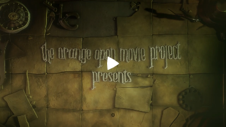
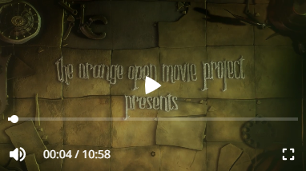
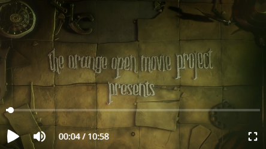
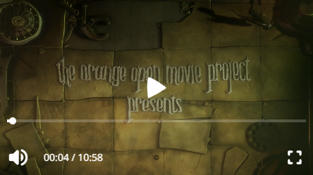
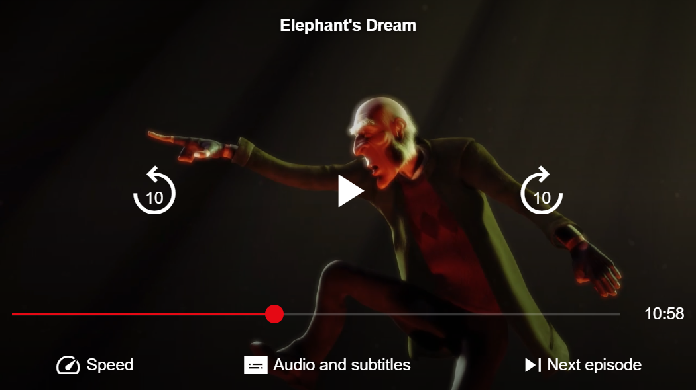

Although the default UI was designed to support a variety of usage scenarios, you may still run into a case that it doesn't handle very well. Perhaps you want to move some buttons around, or add like and dislike buttons to the control bar, or perhaps integrate a text chat component inside your player. In these situations, you may want to build a custom player UI to create a truly unique experience for your viewers.

In this guide, you will build a custom player from scratch, starting from a basic player and gradually adding more features. Finally, we will look at some more complete examples of custom players, which you can use as reference for your own UI.

## A basic player

We'll start by making the most basic player possible: one with just a play button.

```html
<theoplayer-ui
    configuration='{"libraryLocation":"/path/to/node_modules/theoplayer/","license":"your_theoplayer_license_goes_here"}'
    source='{"sources":{"src":"https://example.com/stream.m3u8"}}'
>
    <theoplayer-play-button slot="centered-chrome"></theoplayer-play-button>
</theoplayer-ui>
```

The `<theoplayer-ui>` element is the main container of our custom UI. It handles creating and managing the underlying THEOplayer instance, using the `configuration` and `source` attributes set on the element.

It also provides a skeleton layout for plugging in our playback controls, using [slots](https://developer.mozilla.org/en-US/docs/Web/Web_Components/Using_templates_and_slots#adding_flexibility_with_slots) such as `"top-chrome"` or `"centered-chrome"`. We place a `<theoplayer-play-button>` in the `"centered-chrome"` slot, so it will appear in the center of our player.



Note that by default, the UI hides its controls when the user becomes inactive (i.e. does not interact with the player). If we want the play button to always remain visible, we can add a `no-auto-hide` attribute to it:

```html
<theoplayer-play-button slot="centered-chrome" no-auto-hide></theoplayer-play-button>
```

We can add more components so the user can mute or seek the player, or go fullscreen.

```html
<theoplayer-ui configuration="..." source="...">
    <theoplayer-play-button slot="centered-chrome"></theoplayer-play-button>
    <theoplayer-loading-indicator slot="centered-loading" no-auto-hide></theoplayer-loading-indicator>
    <theoplayer-control-bar>
        <theoplayer-time-range></theoplayer-time-range>
    </theoplayer-control-bar>
    <theoplayer-control-bar>
        <theoplayer-mute-button></theoplayer-mute-button>
        <theoplayer-time-display show-duration></theoplayer-time-display>
        <span style="flex-grow: 1"></span>
        <theoplayer-fullscreen-button></theoplayer-fullscreen-button>
    </theoplayer-control-bar>
</theoplayer-ui>
```

-   `<theoplayer-loading-indicator>` is a circular loading spinner that is automatically shown when the player is waiting for more data. It is placed in the `"centered-loading"` slot, which appears in the center of the player but behind the `"centered-chrome"` elements. The `no-auto-hide` attribute ensures that it is visible even when all other controls are hidden.
-   `<theoplayer-control-bar>` is a horizontal container for playback controls. It's not required that all controls are inside a `<theoplayer-control-bar>`, you can use any element such as a `<div>` or a `<section>`. This element does not have a `slot` attribute, so it is placed in the "default slot", at the bottom of the player.
-   `<theoplayer-time-range>` is a seek bar, showing the player's current position in the video, and allowing the user to seek to a different time.
-   `<theoplayer-mute-button>` is a button to mute or unmute the player's audio.
-   `<theoplayer-time-display>` is a text showing the player's current position in hours, minutes and seconds. By adding the `show-duration` attribute, the text will also show the player's total video duration.
-   `<theoplayer-fullscreen-button>` is a button to make the player take up the entire screen.
-   The `<span>` with `flex-grow: 1` acts as a "spacer": it will stretch to fill the remaining space left by the other controls inside the `<theoplayer-control-bar>`. This works because `<theoplayer-control-bar>` is a flexbox container, i.e. it has `display: inline-flex`. The result is that the `<theoplayer-fullscreen-button>` will be aligned to the right side of the player.



## A mobile-ready player

All components are designed to work great on all device types. However, sometimes you may want to make certain buttons a little bigger on mobile, or move them around a bit to make them easier to reach with the touch of a finger instead of the click of a mouse cursor.

`<theoplayer-ui>` adds a `mobile` attribute to itself when it detects that the user is on a mobile device. You can use this attribute in your own CSS to change the size of all controls:

```css
/* Make controls bigger */
theoplayer-ui[mobile] {
    --theoplayer-control-height: 32px;
}
```

You can also use it to control the visibility of certain controls. To avoid having a CSS rule for each individual component, you can use a custom class or an attribute on those components instead:

```css
/* Hide mobile-hidden elements on mobile, and mobile-only elements on desktop */
theoplayer-ui[mobile] [mobile-hidden],
theoplayer-ui:not([mobile]) [mobile-only] {
    display: none !important;
}
```

```html
<theoplayer-ui configuration="..." source="...">
    <!-- This centered play button will only be shown on mobile -->
    <theoplayer-play-button slot="centered-chrome" mobile-only></theoplayer-play-button>
    <theoplayer-loading-indicator slot="centered-loading" no-auto-hide></theoplayer-loading-indicator>
    <theoplayer-control-bar>
        <theoplayer-time-range></theoplayer-time-range>
    </theoplayer-control-bar>
    <theoplayer-control-bar>
        <!-- This bottom play button will only be shown on desktop -->
        <theoplayer-play-button mobile-hidden></theoplayer-play-button>
        <theoplayer-mute-button></theoplayer-mute-button>
        <theoplayer-time-display show-duration></theoplayer-time-display>
        <span style="flex-grow: 1"></span>
        <theoplayer-fullscreen-button></theoplayer-fullscreen-button>
    </theoplayer-control-bar>
</theoplayer-ui>
```

> **Why do I need to add the styles for `[mobile-hidden]` and `[mobile-only]` to my own CSS?**
>
> Due to limitations of the `::slotted()` CSS selector, `<theoplayer-ui>`'s own CSS rules can only affect _directly_ slotted elements. Descendant elements of a slotted element, such as a `<theoplayer-play-button mobile-hidden>` inside of a slotted `<theoplayer-control-bar>` cannot be targeted by such selectors.

|  |  |
| :-------------------------------------------------------: | :-----------------------------------------------------: |
|                          Desktop                          |                         Mobile                          |

## More examples

### Default UI

It may sound odd to mention the default UI when we're talking about custom UIs. But in fact, the default UI is built in _exactly the same way_ as a custom one!

The default UI comes with all the bells and whistles that you'd expect from a fully-featured player: buttons to play or mute the video, a seek bar to seek through the video, menus to change the audio language and subtitles, and support for casting to Chromecast and AirPlay. It also has an adaptive layout that changes when used on desktop or on mobile, to provide the best experience for that device type.

Have a look at [`DefaultUI.html`](https://github.com/THEOplayer/web-ui/blob/main/src/DefaultUI.html) and [`DefaultUI.css`](https://github.com/THEOplayer/web-ui/blob/main/src/DefaultUI.css) to learn how the default layout is implemented, and perhaps copy some ideas for your own UI.

### Nitflex theme

The "Nitflex" theme shows an example of a fully customized player UI, inspired by a popular streaming platform. It has a custom layout for its playback controls, custom colors to match the brand's style, and even custom icons for its buttons.

Have a look at its [HTML](https://github.com/THEOplayer/web-ui/blob/main/examples/nitflex.html) and [CSS](https://github.com/THEOplayer/web-ui/blob/main/examples/nitflex.css) to see how it's done.


