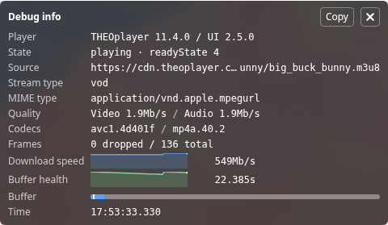

The debug display is an overlay panel that shows playback diagnostics, such as the current source, quality, buffer health and live latency.
It is meant for developers, and is not part of the main Open Video UI bundle.



## Add it to your player

Import `DebugDisplay` and `DebugButton` from the separate `@theoplayer/react-ui/debug` entry point. This entry point is only available as an ES module.

Pass the `DebugDisplay` to the `overlay` prop of your `DefaultUI` or `THEOliveDefaultUI`.
Optionally, add a `DebugButton` to toggle the panel from the control bar.

```jsx
import { DefaultUI } from '@theoplayer/react-ui';
import { DebugButton, DebugDisplay } from '@theoplayer/react-ui/debug';

const App = () => {
    return (
        <DefaultUI
            configuration={{ libraryLocation: '...' }}
            source={{ sources: { src: '...' } }}
            overlay={<DebugDisplay hidden />}
            bottomControlBar={<DebugButton />}
        />
    );
};
```

To inspect a player on any website without changing its code, use the [debug display bookmarklet](../../guides/debug-display.md#bookmarklet).
